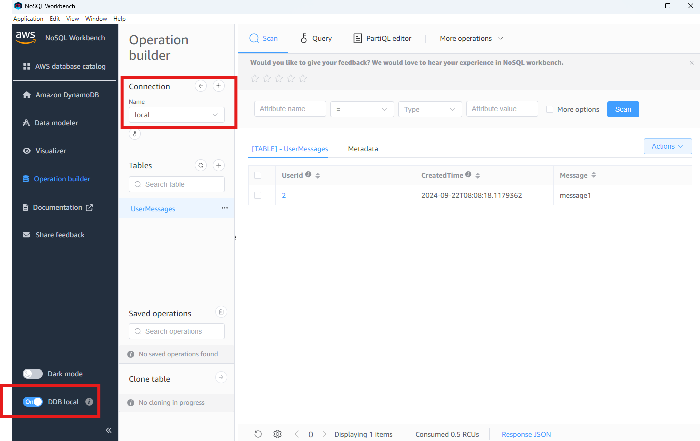
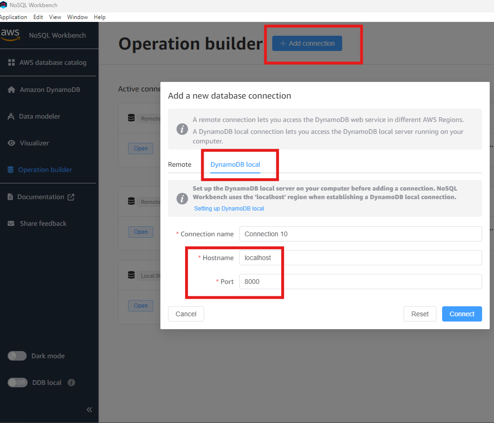
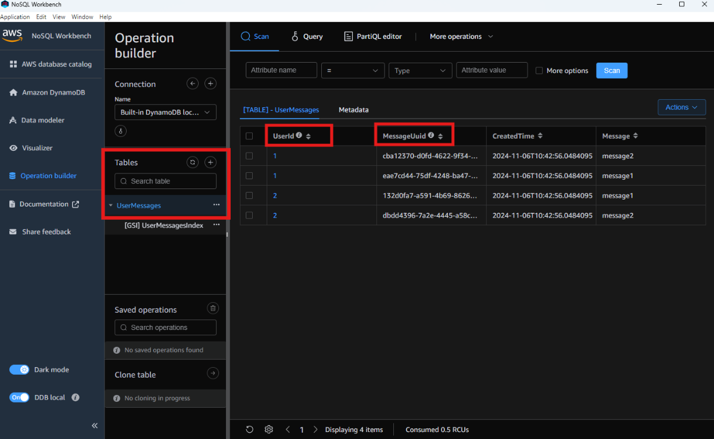
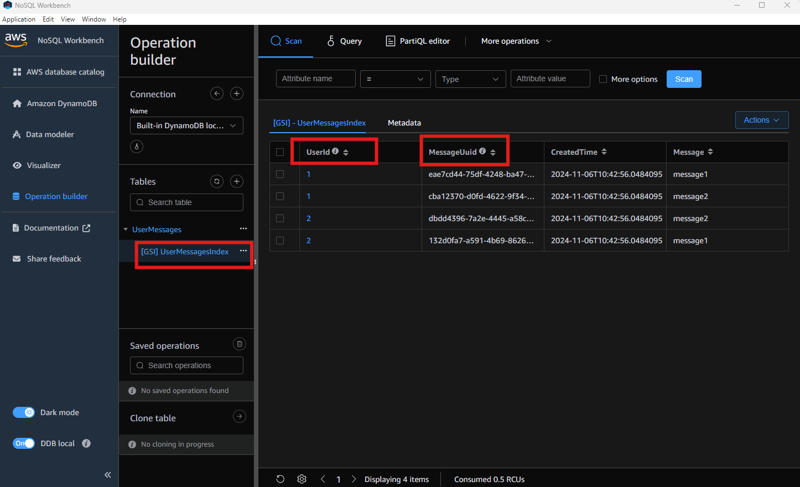

# How to run dynamodb server - local

Use docker compose file to run the dynamodb server locally Or Use workbench and enable DDB local in Workbench:
https://docs.aws.amazon.com/amazondynamodb/latest/developerguide/workbench.html:
https://docs.aws.amazon.com/amazondynamodb/latest/developerguide/DynamoDBLocal.DownloadingAndRunning.html

## How to connect to dynamodb server using workbench

## User-Messages table: PartitionKey: `userId` and SortKey: `MessageUuid`

## Index table: PartitionKey: `userId` and SortKey: `CreatedTime`
